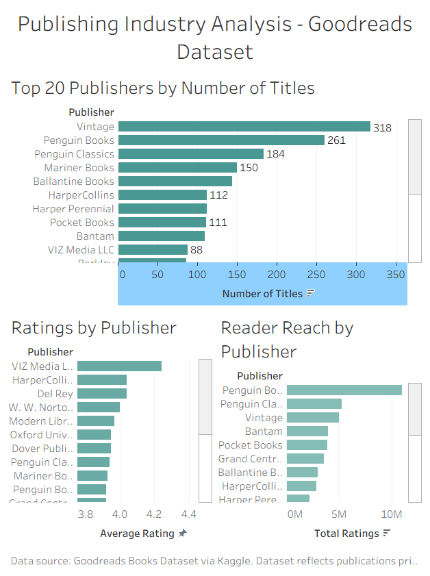

# Publishing Industry Analysis — Goodreads Dataset

## Overview
An exploratory data analysis of publishing trends using a Goodreads dataset of 11,000+ books. This project examines the top 20 publishers by title volume, average reader ratings, and total reader reach to surface insights relevant to the publishing industry.

## Key Questions
- Which publishers produce the most titles?
- Which publishers have the highest average reader ratings?
- Which publishers have the greatest reader reach?

## Tools Used
- Python (pandas) — data cleaning and analysis
- Tableau Desktop — data visualization
- Jupyter Notebook — analysis environment
- Dataset: [Goodreads Books Dataset via Kaggle](https://www.kaggle.com/datasets/jealousleopard/goodreadsbooks)

## Key Findings
- **Penguin Books** leads in reader reach with nearly 11 million ratings despite being #2 in title volume
- **VIZ Media** (manga/graphic novels) has the highest average rating at 4.24, suggesting strong reader loyalty in that category
- **Vintage** publishes the most titles but ranks #3 in reader reach — volume doesn't always equal engagement
- Publishing volume grew nearly 15x between 1990 and 2006 in this dataset

## Data Caveat
This dataset primarily reflects publications through 2006 and is not representative of current publishing trends. Post-2007 data is significantly underrepresented.

## Dashboard Preview

## Files
- `books_analysis.ipynb` — full analysis notebook
- `publisher_summary.csv` — cleaned summary data used for Tableau
